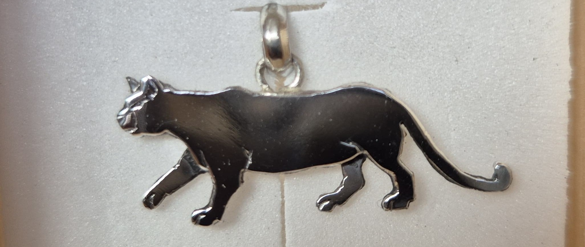

# 🌿 Pudú Orfebrería

> 💍 Joyas inspiradas en la flora y fauna nativa de Chile. Hechas con #AmorNativo y plata 950.

## 🧾 Descripción

**Pudú Orfebrería** es un sitio web dedicado a mostrar una colección de joyas únicas hechas a mano, inspiradas en la naturaleza chilena. Cada pieza representa un animal o elemento simbólico de nuestra tierra, plasmado en plata 950 con diseños artesanales.

Este proyecto nace como homenaje a mi tía Olaya, orfebre y fuente de inspiración, y como forma de conectar arte, identidad y conservación de especies nativas.

## 🔧 Tecnologías utilizadas

- **HTML5** – Estructura semántica del sitio
- **CSS3 / Bootstrap 5** – Estilos responsivos y diseño moderno
- **JavaScript** – Interactividad básica
- **jQuery** – Manipulación del DOM
- **Bootstrap Icons & Font Awesome** – Iconografía
- **Owl Carousel** – Carrusel interactivo

## 🖥️ Características principales

- 📱 Diseño completamente **responsivo**
- 🎥 Carrusel animado en la sección principal
- 📦 Catálogo organizado con **cards interactivas**
- 📞 Footer con botones de contacto directo
- 📚 Historia personal del creador
- 🧭 Navegación limpia e intuitiva

## 📁 Estructura del proyecto

| Archivo/Carpeta | Descripción |
|------------------|-------------|
| **Pudú Orfebrería Bootstrap/**  | Carpeta raíz del proyecto |
| `index.html`     | Página principal |
| `historia.html`   | Información personal |
| `catalogo.html` | Catálogo de prooductos |
| `cotiza.html` | Formulario de cotización |
| `contacto.html`  | Página de contacto |
| `gracias.html`  | HTML de agradecimiento |
| `styles.css`     | Hojas de estilo CSS |
| `script.js`      | Archivos JavaScript |
| `README.md`      | Este archivo |

## 🤝 Contacto

Instagram: [@pudu.orfebreria](https://www.instagram.com/pudu.orfebreria )  
WhatsApp: [+56 9 2638 2796](https://wa.me/56926382796 )

## ❤️ Agradecimientos

Agradezco profundamente a:

- **Mi tía Olaya**, por enseñarme el arte de la orfebrería y por ser la inspiración detrás de este proyecto.
- **La naturaleza chilena**, por ser mi fuente constante de creatividad y conexión con nuestras raíces.
- **La comunidad de código abierto**, por hacer posible herramientas como Bootstrap, Owl Carousel y GitHub, que me han permitido construir este proyecto desde cero.
- **Mis amigos y familia**, por su apoyo constante en este viaje de arte y programación.